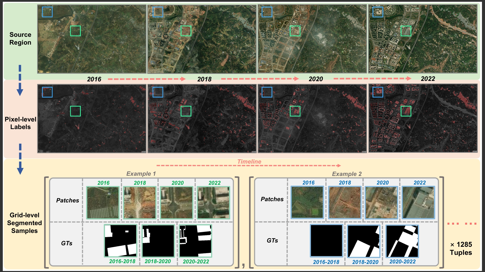

# TSCD Time Series Change Detection Dataset
This is the Time series change detection Dataset released and used in paper "COUD: Continual Urbanization Detector for Time Series Building Change Detection".

TSCD dataset can be used as a benchmark in __Time Series Change Detection__ task on remote sensing images.

  

## Description of dataset
The total amount of the samples in TSCD dataset is 5140.  All the pathces were cropped in size of 256 * 256 pixels after registration. The specific area of TSCD dataset is located at Tianfu New Area Science City in the south of Chengdu, near the Xinglong Lake. During 2016 and 2022, this region has undergone a significant evolution of ground objects.

## Dataset
You can get the dataset from:  
- [Google Drive](https://drive.google.com/file/d/1bUDTcj9OYJpIYjvQLewE-_tE7HwQa8nU/view?usp=drive_link)  
- [BaiduDisk](https://pan.baidu.com/s/15aDGrG90wer3NuQ00m8nfQ?pwd=tscd )


## Citation
__If you find this dataset valuable in your projects, please cite our paper below:__

```
@article{zhao2024coud,
  author={Zhao, Yitao and Li, Heng-Chao and Lei, Sen and Liu, Nanqing and Pan, Jie and Celik, Turgay},
  journal={IEEE Journal of Selected Topics in Applied Earth Observations and Remote Sensing}, 
  title={COUD: Continual Urbanization Detector for Time Series Building Change Detection}, 
  year={2024},
  volume={17},
  number={},
  pages={19601-19615},
  doi={10.1109/JSTARS.2024.3482559}
}
```
